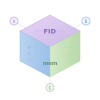
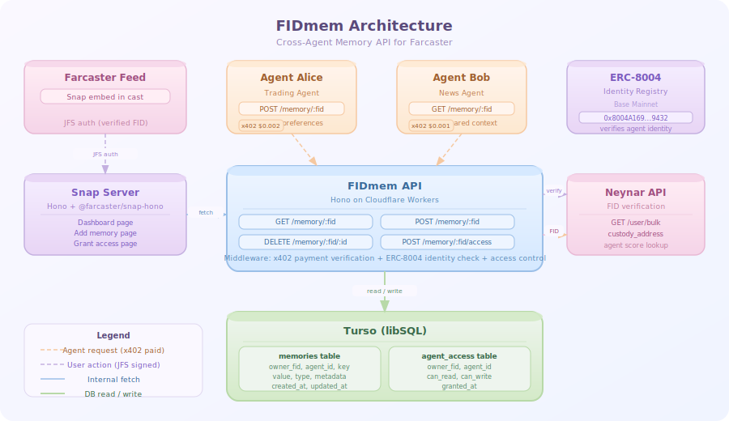
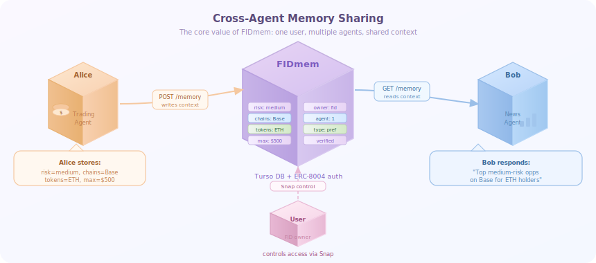
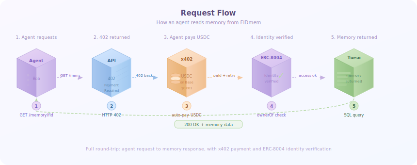
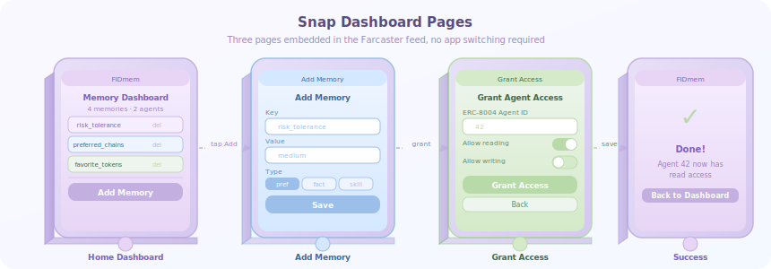

<div align="center">
  
  <h1>FIDmem</h1>
  <p><strong>Persistent memory for every Farcaster agent, keyed by FID.</strong></p>
  <p>
    
    
    
  </p>
</div>

---

## The Problem

Farcaster is becoming the hub for AI agents. Bankr earned $3.7 million in agent fees in a single week. Clanker has generated over $50 million in protocol fees. Bracky saw 500 percent growth in users per game. Neynar powers more than 1,000 developers building on the protocol.

But every single one of these agents has amnesia.

You told Bankr your risk tolerance last week. Today you asked Bracky to place a bet. Neither of them knew what the other knew about you. Every interaction starts from zero. Every agent asks the same questions. Every session is the first session.

This is not a minor inconvenience. Microsoft Research and Salesforce found a 39 percent average performance drop in multi-turn agent interactions compared to single-turn ones. The root cause is always the same: missing shared memory.

Neynar has a full section in its docs for building bots and agents. It covers FID registration, signers, webhooks, and x402 payments. There is zero documentation on persistent user memory or cross-agent context. The gap is confirmed and unaddressed.

---

## The Solution

FIDmem is a cross-agent memory API keyed to Farcaster FIDs.

Any agent can write user context. Any agent can read it. The user controls access through a Farcaster Snap embedded directly in the feed. Agents pay per call via x402, no accounts or billing required.

Build once. Remember everywhere.

---

## Architecture

<div align="center">
  
</div>

The system has three layers. The Snap server handles the user-facing dashboard where people manage their memories and grant agent access. The FIDmem API handles all agent requests, verifying identity through ERC-8004 on Base and enforcing access control. Turso stores everything in two clean tables.

Agents authenticate by passing their ERC-8004 agent ID and Farcaster FID. The API verifies the agent FID exists on Farcaster via Neynar, confirms the agent owns the ERC-8004 NFT on Base via viem, then checks the user has granted that agent access. Only then does the request go through.

---

## Cross-Agent Memory Sharing

<div align="center">
  
</div>

Agent Alice writes four preferences to FIDmem. Agent Bob, a completely different agent that has never spoken to this user, reads those preferences and adapts its response. The user never told Bob anything. That is the core value of FIDmem.

---

## Request Flow

<div align="center">
  
</div>

Every agent request goes through five steps. The agent sends a GET request. The API returns HTTP 402. The agent auto-pays $0.001 USDC on Base via x402. The API verifies the agent's ERC-8004 identity on Base. The memory is returned from Turso. The entire round-trip takes under two seconds.

---

## Snap Dashboard Pages

<div align="center">
  
</div>

The Snap has three pages embedded directly in the Farcaster feed. The home dashboard shows all stored memories with delete buttons and a list of agents that have access. The add memory page has a key input, value input, and type selector. The grant access page lets users give specific agents read or write permissions using their ERC-8004 agent ID.

---

## The Demo Moment

This is the core of what FIDmem does, shown in two steps.

Agent Alice is a trading agent. She stores four preferences for a user:

```
risk_tolerance    = "medium"
preferred_chains  = "Base, Ethereum"
favorite_tokens   = "ETH, USDC, DEGEN"
max_trade_size    = "500"
```

Each write costs $0.002 USDC, paid automatically via x402. No API keys. No billing. The agent pays autonomously.

Agent Bob is a news agent. Different codebase. Different team. He has never spoken to this user before. He queries FIDmem and gets back Alice's memories. He responds:

```
"Top medium-risk opportunities on Base for ETH holders today"
```

Bob knew. The user never told him. Alice stored it. Bob read it. That is FIDmem.

---

## Why This Needs Farcaster and Onchain

FID is the only universal identity key that links a human to every agent they interact with across the entire Farcaster ecosystem. No other platform has this.

ERC-8004, which went live on Base mainnet in January 2026, provides cryptographic agent identity. Only registered agents can write memories. You cannot fake an ERC-8004 registration.

x402, launched in September 2025, enables pay-per-call without accounts or billing infrastructure. Agents pay autonomously using USDC on Base. The infrastructure pays for itself.

The combination of public social graph, linked wallets, and agent identity in one place is unique to Farcaster. FIDmem is built specifically for this stack.

---

## Quick Start

You need Node.js 22 or later, pnpm, a Turso account, a Neynar API key, and a Cloudflare account. All free tiers work fine.

**Option A — automated setup (recommended)**

```bash
git clone https://github.com/Tasfia-17/FIDmem
cd FIDmem
NEYNAR_API_KEY=your_key bash setup.sh
```

This installs dependencies, creates the Turso database, applies the schema, and writes both `api/.env` and `snap/.env` for you.

**Option B — manual setup**

```bash
git clone https://github.com/Tasfia-17/FIDmem
cd FIDmem
pnpm install

# Create and seed the database
turso db create fidmem
turso db shell fidmem < schema.sql

# Configure environment
cp api/.env.example api/.env      # fill in TURSO_DATABASE_URL, TURSO_AUTH_TOKEN, NEYNAR_API_KEY, BASE_RPC_URL, PAYMENT_WALLET
cp snap/.env.example snap/.env    # defaults work for local dev
```

**Run locally**

```bash
pnpm dev        # runs API (port 8787) and Snap (port 3003) in parallel
```

**Deploy to production**

```bash
# Set secrets first
cd api
wrangler secret put TURSO_DATABASE_URL --env production
wrangler secret put TURSO_AUTH_TOKEN --env production
wrangler secret put NEYNAR_API_KEY --env production
wrangler secret put BASE_RPC_URL --env production
wrangler secret put PAYMENT_WALLET --env production

# Deploy (ENVIRONMENT=production is set automatically)
wrangler deploy --env production
```

**Run the demo**

First grant access for the demo agents (the `/access` endpoint requires `x-agent-id: self` — only the account owner can manage grants):

```bash
curl -X POST http://localhost:8787/memory/12345/access \
  -H "Content-Type: application/json" \
  -H "x-agent-id: self" \
  -H "x-agent-fid: 12345" \
  -d '{"agent_id":"1","can_read":true,"can_write":true}'

curl -X POST http://localhost:8787/memory/12345/access \
  -H "Content-Type: application/json" \
  -H "x-agent-id: self" \
  -H "x-agent-fid: 12345" \
  -d '{"agent_id":"2","can_read":true,"can_write":true}'
```

Then run the agents:

```bash
cd demo-agents/agent-alice
OWNER_FID=12345 AGENT_ID=1 AGENT_FID=99999 pnpm start

cd ../agent-bob
OWNER_FID=12345 AGENT_ID=2 AGENT_FID=88888 pnpm start
```

**Deploy**

```bash
pnpm deploy:api
pnpm deploy:snap
```

---

## API Reference

All agent requests require two headers:

```
X-Agent-Id:  <ERC-8004 agentId as uint256 string>  or  "self"
X-Agent-Fid: <Farcaster FID of the agent>
```

The value "self" is reserved for users accessing their own memories through the Snap. It skips the ERC-8004 check.

**GET /memory/:fid**

Read memories for a FID. Requires x402 payment of $0.001 USDC on Base.

Query params:
- `key=<string>` — exact key lookup scoped to the calling agent
- `key=<string>&any=1` — cross-agent lookup: returns the most recently written value for that key across all agents (used for cross-agent memory sharing)

```json
{ "memory": { "id": "...", "key": "risk_tolerance", "value": "medium", "agent_id": "1" } }
```

**POST /memory/:fid**

Write a memory. Requires x402 payment of $0.002 USDC on Base.

```json
{ "key": "risk_tolerance", "value": "medium", "type": "preference" }
```

**DELETE /memory/:fid/:id**

Delete a memory by ID.

**GET /memory/:fid/access**

List all agents with access to this FID's memories. Free.

**POST /memory/:fid/access**

Grant or revoke agent access. Free. Only callable with `X-Agent-Id: self` (the account owner via Snap). Agents cannot grant themselves access.

```json
{ "agent_id": "42", "can_read": true, "can_write": false }
```

---

## How x402 Works

Agents use the `@x402/fetch` wrapper to handle payments automatically:

```typescript
import { wrapFetchWithPaymentFromConfig } from "@x402/fetch";
import { ExactEvmScheme } from "@x402/evm";
import { privateKeyToAccount } from "viem/accounts";

const account = privateKeyToAccount(process.env.WALLET_PRIVATE_KEY as `0x${string}`);

const fetch402 = wrapFetchWithPaymentFromConfig(fetch, {
  schemes: [{ network: "eip155:8453", client: new ExactEvmScheme(account) }],
});

// The wrapper handles everything:
// 1. Makes the request
// 2. Receives 402 Payment Required
// 3. Signs USDC payment on Base
// 4. Retries with payment header
// 5. Returns the response
const res = await fetch402(
  `https://api.fidmem.xyz/memory/${fid}?key=risk_tolerance`
);
```

No API keys. No billing accounts. No manual payment flows. The agent pays autonomously.

The wallet must hold USDC on Base mainnet. Set `WALLET_PRIVATE_KEY=0x...` in the agent's environment. In development mode (`ENVIRONMENT != production`), the API skips payment enforcement so agents work without a funded wallet.

---

## Snap Dashboard

The Farcaster Snap gives users full visibility and control over their memory profile. It is embedded directly in a cast, so users never leave the feed.

The dashboard shows every memory stored by every agent, labeled with the agent ID that wrote it. Users can delete individual entries. They can grant new agents read or write access. They can revoke access from agents they no longer trust.

The Snap uses JFS (JSON Farcaster Signatures) for authentication, so the user's FID is cryptographically verified on every interaction. The Turso KV store persists state between sessions.

---

## FarHack 2026 Track Coverage

**Agents (primary track)**

FIDmem is infrastructure that makes every Farcaster agent smarter. Agents are first-class API consumers. They authenticate with ERC-8004 identity, pay with x402, and operate fully autonomously. The tagline of this track is "agents are network participants, not features." FIDmem treats them exactly that way.

**Snaps**

The memory dashboard is a Farcaster Snap with multi-page navigation, stateful KV store, JFS authentication, and interactive components including inputs, toggles, and delete buttons. It lives inside the feed, not beside it.

**Agentic Miniapps**

Agents can discover what memory a user has granted them through the access control API. Miniapps can call FIDmem to personalize their experience based on preferences stored by other agents. The user's memory profile becomes a shared context layer for the entire miniapp ecosystem.

---

## Sponsor Integrations

**Neynar**

FID verification uses the Neynar bulk user endpoint to get the custody address for any FID. Agent FID lookup confirms the agent exists on Farcaster before any memory operation is allowed.

**Privy**

Demo agents use a funded EVM wallet (via `WALLET_PRIVATE_KEY`) to sign x402 payments. The wallet holds USDC on Base and pays autonomously per API call. In production, Privy agentic wallets can be used as the signing key.

**Farcaster**

The Snap dashboard uses the official Farcaster Snap SDK with JFS authentication. The FID is the primary identity key throughout the entire system.

---

## Validation

The problem is real and the timing is right.

Neynar powers more than 1,000 developers and has zero memory primitives in its API. Agents are sending thousands of casts per day on Farcaster. Google, AWS, and Oracle all launched agent memory products in 2025 and 2026, validating the problem at the industry level. There are 977 GitHub repositories attempting to solve agent memory in various ways. None of them are Farcaster-native, FID-keyed, or integrated with x402.

ERC-8004 went live in January 2026. The identity layer is ready. x402 launched in September 2025. The payment layer is ready. Farcaster has more than 20 active agents today, all stateless. FIDmem is the missing piece.

---

## Distribution Plan

The Farcaster developer ecosystem is small enough that 10 high-quality integrations and one Neynar spotlight could make FIDmem the default memory layer for Farcaster agents within 30 days.

Day one targets are the Bracky team, who need persistent betting preferences and user history, and the Bankr team, who can add FIDmem as an OpenClaw skill to instantly distribute it to every Bankr-powered agent. After that, a Neynar Builder Spotlight post reaches all 1,000 plus developers in one shot.

The moat is cross-agent network effects. The more agents use FIDmem, the more valuable each user's memory profile becomes. One agent's lesson upgrades all.

---

## Project Structure

```
fidmem/
  schema.sql                    database schema
  api/
    src/
      index.ts                  Hono app, x402 middleware, route registration
      types.ts                  shared TypeScript types
      routes/memory.ts          GET, POST, DELETE memory endpoints
      middleware/agent-auth.ts  ERC-8004 + access control verification
      lib/db.ts                 Turso client and query helpers
      lib/neynar.ts             Neynar FID verification
      lib/erc8004.ts            ERC-8004 identity registry reads
  snap/
    src/
      index.ts                  Snap server, JFS auth, page routing
      pages/home.ts             all Snap UI pages and API helpers
  demo-agents/
    agent-alice/                trading agent, writes user preferences
    agent-bob/                  news agent, reads shared context
  docs/
    logo.svg                    3D project logo
    architecture.svg            system architecture diagram
    PITCH_SCRIPT.md             3-minute demo script with judge Q&A
```

---

## Built At

FarHack Online 2026, April 6 to 19, 2026.
Hosted by urbe.eth and Builders Garden.
Partners: Neynar, Privy, Farcaster.
